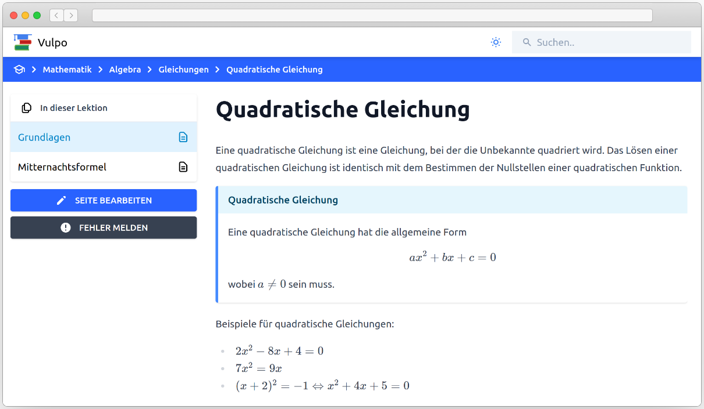

# Vulpo

Open-Source E-Learning Platform.

## References

- [MDX](https://mdxjs.com/)
- [Gatsby](https://www.gatsbyjs.com/)

## License

[MIT](https://github.com/lukasnehrke/vulpo/blob/main/LICENSE) © Lukas Nehrke
